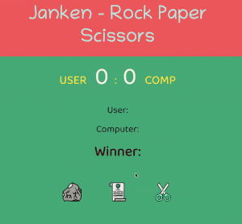

# fsjs-js-assignment

# 1-Accordian

# 2-Name-Conversion

# 3-Color-Changer

# 4-Password-Generator

# 5-Rock-Paper-Scissors

# 6-JokesGenerator-API
[View Source](./06JokesGenerator%20-%20API/)

# 7-QR-Code-Generator-API
[View Source](./07QRCodeGenerator%20-%20API/)

# basic counter

# Click the button

# see what you type
